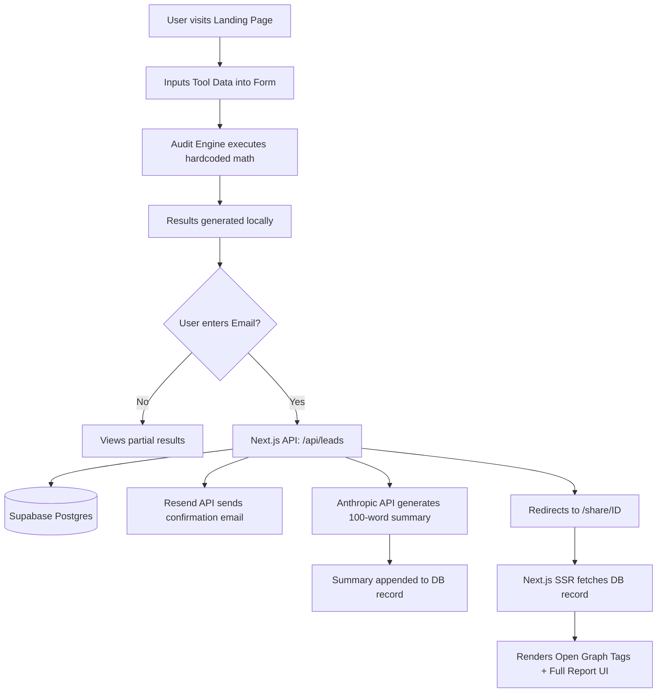

# Architecture

## System Diagram

## Data Flow
1. **Input Phase**: The user inputs their AI tool usage via a multi-step React form. The state is temporarily held in memory (and `localStorage` to persist across reloads).
2. **Evaluation Phase**: The frontend `auditEngine.ts` processes the inputs against hardcoded pricing rules (derived from `PRICING_DATA.md`) to calculate current spend, optimized spend, and savings.
3. **Capture Phase**: To view the full report (and generate the shareable link), the user submits their email. This calls `/api/leads`.
4. **Backend Processing Phase**:
   - The `/api/leads` route securely calls the Anthropic API to synthesize the summary based on the math engine's output.
   - It saves the user's email, inputs, savings data, and the LLM summary to a Supabase PostgreSQL database.
   - It triggers a transactional email via Resend.
5. **Display Phase**: The user is redirected to `/share/[id]`. Next.js Server-Side Rendering (SSR) fetches the record from Supabase, injects the dynamic Open Graph meta tags, and serves the page.

## Stack Justification
- **Next.js (App Router)**: Chosen over Vite/SPA specifically for its SSR capabilities. The assignment requires "Open Graph tags for clean link previews." Client-side apps struggle to provide dynamic OG tags because crawlers don't execute JS reliably. Next.js solves this. Additionally, Next.js API routes provide a secure backend to call the Anthropic API without exposing the secret key in the browser.
- **Tailwind CSS + Shadcn**: Used for rapid UI development. The assignment emphasizes visual quality ("This is the page that gets screenshotted"). Tailwind allows for beautiful, responsive design without writing custom CSS from scratch.
- **Supabase**: A fast, free PostgreSQL database. Chosen because it fulfills the "real backend" requirement with zero friction and works perfectly with Next.js.
- **Resend**: Chosen for the transactional email requirement due to its generous free tier and clean API.

## Scaling to 10k Audits/Day
If this had to handle 10,000 audits per day, I would change the following:
1. **Background Jobs for LLM and Email**: Currently, the `/api/leads` route synchronously waits for the Anthropic API and Resend before returning the ID. At 10k/day, this would lead to timeouts and poor UX. I would offload the LLM summary generation and email sending to a background queue (like Inngest, Upstash, or Trigger.dev). The UI would show a "Generating your personalized summary..." skeleton loader until the background job completes.
2. **Caching Pricing Logic**: The pricing data would be moved from a hardcoded file to a database table or a CMS (like Sanity) so it could be updated by non-technical staff without requiring a redeploy.
3. **Database Indexing**: The `share_id` column in Supabase would need a proper index for fast lookups on the `/share/[id]` route to handle the viral traffic effectively.
